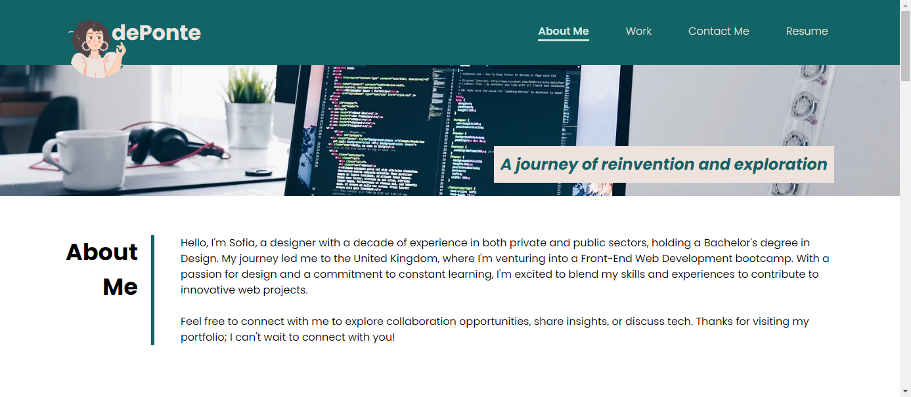

# dePonte Web Portfolio

This is my personal portfolio website showcasing my work and providing information about me.

## Description about me

Hello, I'm Sofia, and I'm on a journey of reinvention and exploration. 

With a Bachelor's degree in Design and a decade of experience in both the private and public sectors, I've honed my creative and problem-solving skills. My work as a designer has allowed me to tackle a wide range of challenges, from crafting captivating visuals to designing user-friendly interfaces.

My career path has led me to the United Kingdom, and I've decided to embark on an exciting new adventure - a career change into the world of web development. I'm currently enrolled in a Front-End Web Development bootcamp, where I'm immersing myself in the world of HTML, CSS, and JavaScript, and learning to transform ideas into interactive digital experiences.

My journey is marked by a passion for design, a dedication to continuous learning, and an unquenchable curiosity about the ever-evolving tech landscape. I'm eager to leverage my unique blend of skills and experiences in the web development field and contribute to innovative projects and teams.

Feel free to connect with me to discuss collaboration opportunities, share insights, or just have a good tech chat.

Thank you for visiting my portfolio, and I look forward to connecting with you!

## Table of Contents

Use this table of contents to quickly navigate to the information you need:

- [User Story](#user-story)
- [Acceptance Criteria](#acceptance-criteria)
- [Screenshot](#screenshot)
- [Usage](#usage)
- [Credits](#credits)
- [Features](#features)
- [Deployment](#deployment)
- [License](#license)
- [Badges](#badges)

## User Story

**AS A** prospective employer or visitor to my portfolio website,  
**I WANT** to easily navigate through the sections of the portfolio,  
**SO THAT** I can quickly learn about the author, view their work, and find their contact information, all in one place.

## Acceptance Criteria

To complete.

## Screenshot

*The image above provides a visual representation 'About Me' of the main page. It showcases both the appearance and functionality of the web application.*

## Usage

To view this Portfolio project locally or make use of the code, follow these steps:

1. **Clone the Repository:**
`git clone https://github.com/deponte-designer/deponte-web-portfolio.git`

2. **Navigate to the Project Directory:**
`cd horiseon-website-accessibility-optimization`

3. **Open the HTML File:**
- Locate the `index.html` file in your code editor.
- Open it in a web browser to view the project.

Feel free to explore the code, make modifications, and provide feedback. If you have suggestions or improvements to share, please don't hesitate to create a pull request or submit an issue on the GitHub repository.

>Your input and contributions are highly valuable, and they will help enhance the project further!

## Credits

### Tutorials and Resources

#### For the README.md file
- [Awesome README examples](https://github.com/matiassingers/awesome-readme)
- Articles on Acceptance Criteria:
  - [Acceptance Criteria for User Stories: Purposes, Formats, Examples, and Best Practices](https://www.altexsoft.com/blog/business/acceptance-criteria-purposes-formats-and-best-practices/)
  - [Acceptance Criteria: Why It’s Important and How to Write It](https://blog.american-technology.net/acceptance-criteria/)
- [Markdown Cheat Sheet](https://www.markdownguide.org/cheat-sheet)
- [Markdown Badges](https://github.com/Ileriayo/markdown-badges)

#### For the index.html file
- [Semantic HTML](https://www.w3schools.com/html/html5_semantic_elements.asp)

#### For the style.css file
- [CSS CheatSheet](https://htmlcheatsheet.com/css/)

#### Website Accessibility Testing
- [Web Accessibility Evaluation Report](https://wave.webaim.org/report#/https://deponte-designer.github.io/horiseon-website-accessibility-optimization/)

## Features

To complete.

>Your support and feedback are greatly appreciated as I work on these improvements!

## Deployment

This project is deployed and accessible at the following URLs:

- [Live Application](https://deponte-designer.github.io/deponte-web-portfolio): Explore the demo live version of the website.

- [GitHub Repository](https://github.com/deponte-designer/deponte-web-portfolio): Visit the repository for the project, which includes a README describing the details.

## Conclusion

Thank you for visiting this Portfolio project. Your support, feedback, and contributions are greatly appreciated as we work to make the web more accessible and user-friendly. If you have any suggestions, issues to report, or ideas for collaboration, please don't hesitate to reach out. Together, we can continue to improve this project and create a better web experience for everyone.

**Happy coding!**

## License

Copyright (c) 2023 [dePonte](https://github.com/deponte-designer)

Permission is hereby granted, free of charge, to any person obtaining a copy of this software and associated documentation files (the "Software"), to deal in the Software without restriction, including without limitation the rights to use, copy, modify, merge, publish, distribute, sublicense, and/or sell copies of the Software, and to permit persons to whom the Software is furnished to do so, subject to the following conditions:

The above copyright notice and this permission notice shall be included in all copies or substantial portions of the Software.

THE SOFTWARE IS PROVIDED "AS IS", WITHOUT WARRANTY OF ANY KIND, EXPRESS OR IMPLIED, INCLUDING BUT NOT LIMITED TO THE WARRANTIES OF MERCHANTABILITY, FITNESS FOR A PARTICULAR PURPOSE AND NONINFRINGEMENT. IN NO EVENT SHALL THE AUTHORS OR COPYRIGHT HOLDERS BE LIABLE FOR ANY CLAIM, DAMAGES OR OTHER LIABILITY, WHETHER IN AN ACTION OF CONTRACT, TORT OR OTHERWISE, ARISING FROM, OUT OF OR IN CONNECTION WITH THE SOFTWARE OR THE USE OR OTHER DEALINGS IN THE SOFTWARE.

## Badges

